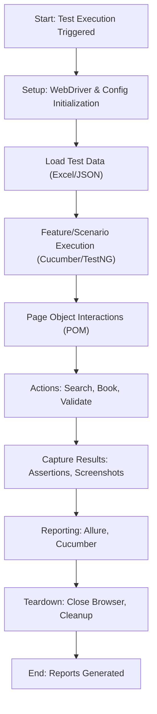

# BookMyShow Test Automation Framework

## Project Title
BookMyShow Test Automation Framework

## Project Overview
A robust, scalable, and maintainable test automation framework for the BookMyShow web application.

**Brief description:**
- Automates end-to-end user journeys such as login, event/movie search, and validation.
- Covers both positive and negative scenarios.
- Ensures cross-browser compatibility and data-driven testing.

**What the framework tests:**
- Home page, login, event/movie search, and validation flows.

---

## Architecture & Design

- **Design Patterns Implemented:**
  - **Page Object Model (POM):** Encapsulates page elements and actions for maintainability.
  - **Data-Driven Testing:** Test data is externalized in Excel (`testdata.xlsx`) and JSON.
  - **BDD with Cucumber:** Gherkin feature files for business-readable test scenarios.

- **Framework Architecture:**
  - **Base Classes:** WebDriver setup, teardown, and configuration management.
  - **Page Objects:** Encapsulate UI elements and actions for each page.
  - **Step Definitions:** Map Gherkin steps to Java methods.
  - **Hooks:** Setup/teardown logic for each scenario.
  - **Listeners:** Retry, screenshot, and reporting integration.

---

## Technology Stack

- **Core Technologies:** Java 11+, Selenium WebDriver 4, TestNG, Cucumber 7
- **Build & Dependency Management:** Maven, WebDriverManager
- **Data & Reporting:** Apache POI (Excel), Jackson (JSON), Allure, Log4j2

---

## Key Features

- **Core Capabilities:**
  - Cross-browser execution (Chrome, Firefox, etc.)
  - Data-driven testing (Excel/JSON)
  - Page Object Model (POM)
  - Multi-window/tab handling
  - Retry mechanism for flaky tests

- **Advanced Features:**
  - Allure and ExtentReports integration
  - Automatic screenshot capture on failure
  - TestNG and Cucumber reporting
  - Logging with Log4j2

---

## Project Structure

```
BookMyShow/
  bookmyshow-1/
    allure-results/           # Allure raw results
    logs/                     # Execution logs
    src/
      main/
        java/com/bookmyshow/
          base/               # Driver setup, base classes
          listeners/          # Retry, screenshot, reporting listeners
          models/             # Data models (POJOs)
          pages/              # Page Object Model classes
          utils/              # Helpers (Excel, config, browser, etc.)
        resources/
          config.properties   # App and framework config
          log4j2.xml          # Logging config
      test/
        java/com/bookmyshow/
          hooks/              # Cucumber hooks
          reRun/              # Retry logic
          runners/            # Test runners (TestNG/Cucumber)
          stepDefinitions/    # Step definitions for features
        resources/
          allure.properties   # Allure config
          config/             # Env-specific configs
          cucumber.properties # Cucumber config
          features/           # Gherkin feature files
          output/             # Test output
          testdata/           # Excel test data
    pom.xml                   # Maven config
    testng.xml                # TestNG suite config
    README_CUCUMBER.md        # Cucumber-specific instructions
```

---

## Running Tests

- **Via Maven (default):**
  ```sh
  mvn clean test
  ```
- **Via TestNG XML:**
  ```sh
  mvn test -DsuiteXmlFile=testng.xml
  ```
- **Via IDE:**
  - Right-click any runner class (e.g., `TestRunner`, `SmokeTestRunner`) and select "Run".

- **Cucumber Tags:**
  - `@smoke` for smoke tests
  - `@regression` for regression suite

---

## Test Flow



**Detailed Steps:**
1. **Setup:** WebDriver and configuration initialized via `DriverSetup` and `ConfigReader`.
2. **Data Loading:** Test data loaded from Excel/JSON.
3. **BDD Feature Execution:** Cucumber/TestNG runners execute scenarios.
4. **Page Interactions:** Actions performed using POM classes.
5. **Assertions & Validation:** Results validated, screenshots captured on failure.
6. **Reporting:** Results sent to Allure, and Cucumber reports.
7. **Teardown:** Browser closed, resources cleaned up.

---

## Reporting

- **ExtentReports Dashboard:**  
  - Location: `test-output/ExtentReports/`
  - Features: Interactive HTML dashboard, step logs, screenshots

- **Allure Reports:**  
  - Location: `allure-results/` (raw), served via `mvn allure:serve`
  - Features: Interactive, historical trends, attachments

- **Cucumber Reports:**  
  - Location: `target/cucumber-html-reports/`, `target/cucumber-json-reports/`
  - Features: HTML, JSON, JUnit XML outputs

- **Screenshot Management:**  
  - Location: `test-output/screenshots/`
  - Trigger: On test failure (via listeners)
  - Integration: Linked in Allure reports

- **TestNG Reports:**  
  - Location: `test-output/`
  - Files: `index.html`, `emailable-report.html`

---

## Configuration

- **Application Configuration:**  
  - File: `src/main/resources/config.properties`
  - Example:
    ```
    app.url=https://in.bookmyshow.com
    browser=chrome
    implicit.wait=10
    explicit.wait=10
    page.load.timeout=30
    test.data.file=src/test/resources/testdata/testdata.xlsx
    extent.report.path=test-output/ExtentReports/
    screenshot.path=test-output/screenshots/
    ```

- **Test Data Structure:**  
  - Excel: `src/test/resources/testdata/testdata.xlsx`
  - Cucumber: Data tables in feature files or external JSON

---

## Framework Highlights for Interview

- **Industry Best Practices:**
  - Modular, maintainable codebase (POM, utilities, listeners)
  - Data-driven and BDD approaches
  - Robust reporting and logging
  - Retry and screenshot on failure

- **Technical Skills Showcased:**

  - Selenium WebDriver, TestNG, Cucumber, Maven
  - Advanced reporting (Allure, Extent)
  - Java OOP, design patterns, exception handling
  - Integration with CI/CD (future roadmap)

---

## GitHub Link
  - https://github.com/VaibhavPagare24/BookMyShow

---

## Author

- **Name:** [VAIBHAV SADASHIV PAGARE]
- **Emp ID:** [2421386]